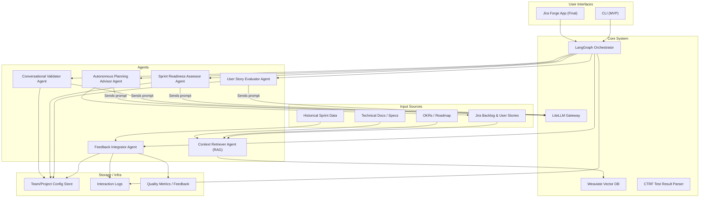

# Architectural Design

## Purpose

An AI-powered, multi-agent system that evaluates user stories and sprint readiness, continuously
improves through feedback, and interacts with users via conversation.

## 📌 Overview

The Agentic Agile Coach is a modular, self-learning AI system that empowers Agile teams to:

- Evaluate user story quality via expert criteria.
- Assess and improve sprint backlog readiness.
- Converse to clarify or update stories.
- Learn from delivery outcomes and user feedback.

It uses a multi-agent architecture with an orchestrator (LangGraph), a RAG pipeline (Weaviate),
and LiteLLM for flexible LLM calls.

## 🧱 System Architecture



## 🧩 Core Components

### 🕸️ Task Orchestrator

Coordinate all other agents in a structured task graph depending on input type and agent responses.

#### Responsibilities

- Route user inputs to the right agent
- Maintain state (e.g., backlog, sprint metadata)
- Coordinate multi-step workflows (e.g., clarify → re-evaluate → finalize)

#### Key Skills

- Conditional logic
- Conversation flow memory
- Dynamic agent invocation

### 📝 User Story Evaluator Agent

Evaluate the quality of a single user story against defined assessment criteria.

#### Inputs

- Jira user story
- Product context (goal, epic, roadmap alignment)
- RAG context (dependencies, history, alignment with goals etc.)

#### Outputs

- Score (0–10) per criterion
- Summary of improvements
- Confidence score (based on past story performance)

#### Key Skills

- Structured evaluation
- Natural language understanding
- RAG-based context integration

#### Learning Signal

Track correlation between scores and actual sprint outcomes (e.g., delivery success, rework, carryover).

### 📋 Sprint Readiness Assessor Agent

Evaluate the entire sprint backlog to determine if it's ready for execution.

Considers completeness,  velocity, roadmap, dependencies, sequence, risk, alignment with goals,
sequencing

#### Inputs

- List of user stories
- Sprint goal
- Team velocity
- OKRs and roadmap
- Historical sprint success/failure data

#### Outputs

- RAG status (Red/Amber/Green)
- Justification report
- Actions required to reach readiness

#### Key Skills

- Pattern recognition
- Risk/dependency mapping
- Sequence/timing evaluation

#### Learning Signal

Learns which readiness gaps most often correlate with failed sprints.

### 🗣 Conversational Validator Agent

Talk to the user to resolve missing, ambiguous, or conflicting information in the backlog.

#### Inputs

- Sprint evaluation reports
- Story-level feedback
- Product roadmap and sprint objectives

#### Outputs

- Clarifying questions
- Suggested updates
- Backlog updates (add/remove/edit stories)

#### Key Skills

- Dialogue management
- Contextual memory
- Intent understanding

#### Learning Signal

Learns from successful clarification patterns (which types of prompts improve quality fastest).

### 🧠 Context Retriever Agent (RAG)

Provide relevant context to support story and backlog evaluation.

#### Inputs

- Query from another agent
- Vector search index (Weaviate or equivalent)

#### Sources

- Product roadmap
- OKRs
- Domain knowledge: Confluence or internal wiki content
- Previous sprints
- Delivery history
- Dependencies
- Domain knowledge

#### Outputs

- Extracted context snippets
- Metadata (source, confidence)

#### Key Skills

- Dense vector search
- Metadata filtering
- Long-context summarization

### 📊 Feedback Integrator Agent

Learn from performance and feedback to tune system behavior.

#### Inputs

- Sprint outcomes (velocity, bugs, spillover, rework, success rate)
- User feedback (manual ratings, overrides, comments)
- Assessment predictions vs actual results

#### Outputs

- Updates to scoring thresholds
- Adjustment of weighting for criteria
- Model fine-tuning parameters

#### Key Skills

- Pattern analysis
- Drift detection
- Reinforcement-like feedback incorporation

#### Optional Tech

- LangGraph memory node
- Fine-tuning queues
- Rules + ML hybrid feedback processing

### 💬 User Interface

- CLI, web frontend (Jira Forge), or chatbot in Slack/Teams
- Allows users to:
  - Submit backlogs and stories
  - View evaluations
  - Have interactive conversations for refinement

### 📊 Optional Future Agents

- Persona Coach Agent (tailors advice based on team maturity)
- Story Generator Agent (creates new stories based on gaps)
- Stakeholder Alignment Agent (ensures backlog reflects roadmap/OKRs)

## 🧠 Data Flows

1. User inputs backlog and context via UI.
2. Task Orchestrator determines whether to:
  - Score individual stories.
  - Assess sprint readiness.
  - Begin clarification dialogue.
3. RAG module provides additional context.
4. Agents perform tasks and return results.
5. Feedback loop evaluates outcomes over time to improve future predictions.

## ⚠️ Edge Case Handling

| Edge Case                                    | Strategy                                                                   |
|----------------------------------------------|----------------------------------------------------------------------------|
| Incomplete or malformed stories              | Validator agent requests clarification. Can suggest edits or ignore story. |
| Contradictory context (e.g., roadmap vs OKR) | Orchestrator resolves priority or escalates for user resolution.           |
| Missing velocity or sprint history           | Use fallback defaults or prompt user to input manually.                    |
| Ambiguous sprint goals                       | Validator agent engages in conversation to clarify.                        |
| Context overload from RAG	                   | Limit to top-k relevant documents and summarize with LLM.                  |

## 🔐 Security & Data Sensitivity

| Concern                    | Mitigation Strategy                                                                   |
|----------------------------|---------------------------------------------------------------------------------------|
| Sensitive business data    | Encrypt data at rest and in transit; store only minimal data.                         |
| PII in stories or comments | Apply redaction or filtering layer (e.g., regex-based PII scrubber).                  |
| Model call privacy         | Use self-hosted or private API endpoints where possible (e.g., Azure OpenAI, Ollama). |
| Prompt injection attacks   | Validate user inputs; sanitize messages before sending to LLM.                        |
| LLM memory misuse          | Scope memory per sprint/project. Disallow cross-project leakage.                      |
| Access control             | Require user auth for UI access (OAuth, GitHub, etc.).                                |

## 🚦 Performance & Resilience

### Performance Considerations

- Use async LiteLLM calls and caching where possible.
- Batched story evaluations to reduce roundtrips.
- Limit RAG queries with semantic filters.
- Background task queue (e.g., Celery) for post-sprint analysis.

### Resilience Design

- Circuit breakers for model/API failures.
- Fall back to cached scoring heuristics if LLM is unavailable.
- Graceful degradation: validator explains what’s missing.
- Local LLM support as offline fallback (e.g., Mistral or TinyLlama).

## 📊 Scalability Strategy

- Stateless agent containers can scale independently.
- Store backlog + evaluation state in shared DB (PostgreSQL or Firestore).
- Vector DB (Weaviate) supports sharding & horizontal scaling.
- Add Redis queue for concurrent feedback processing.

## 🔁 Self-Learning Feedback Loop

| Input                           | Usage                                                      |
|---------------------------------|------------------------------------------------------------|
| Sprint delivery success/failure | Adjust scoring heuristics and backlog predictions.         |
| Manual user ratings             | Tweak model prompts or reward preferred response patterns. |
| Historical trends               | Track recurring issues, refine quality criteria weighting. |

## 📦 Tech Stack Summary

| Layer             | Tech Choices                                     |
|-------------------|--------------------------------------------------|
| LLM API           | LiteLLM                                          |
| Orchestration     | LangGraph                                        |
| RAG Engine        | Weaviate                                         |
| Data Storage      | PostgreSQL or Firebase                           |
| Caching & Queue   | Redis + Celery                                   |
| Feedback Learning | Rules-based + fine-tuning pipeline (later phase) |
| UI                | To be determined. CLI only for initial version   |
| Deployment        | Docker + Fly.io / Railway / Vercel               |
| Model             | Claude Sonnet                                    |

### Future Extensions

- Jira API integration for push/pull of sprint data
- Prometheus/Grafana dashboard for analytics
- Reinforcement fine-tuning via OpenAI or Hugging Face pipelines
- Integration with calendar/tools to automate planning ceremonies

## ✅ MVP Definition

| Feature	                           | Included in MVP |
|------------------------------------|-----------------|
| Story Evaluator Agent              | ✅              |
| Sprint Readiness Assessor Agent    | ✅              |
| Context Retriever via RAG (basic)  | ✅              |
| Conversational Validator           | ✅              |
| LiteLLM-backed model access        | ✅              |
| CLI or Web Interface               | ✅              |
| Feedback learning (manual logging) | Optional        |
| Jira integration                   | ❌ (future)     |


## 🧩 Frictionless User Experience

The system should feel like a natural extension of the user’s Agile workflow, with minimal
disruption or cognitive load—starting with a lightweight CLI for early adopters, and maturing into
a deeply integrated Jira Forge app.

### MVP UX: Command Line Interface (CLI)

#### Purpose

The CLI allows developers, Agile Coaches, and product owners to test and iterate with the system
quickly—no installation, no UI, no external dependencies beyond basic auth tokens or config files.

#### Key Features:

- analyze-story <story-id>: Scores a single story with feedback
- check-backlog <sprint-id>: Reviews full sprint backlog for readiness
- clarify <story-id>: Triggers conversational clarification agent
- suggest-fix <story-id>: Applies lightweight suggestions via Jira API
- generate-story --from "<goal>": Drafts new user story from input goal
- Config via .coachrc or environment variables
- JSON/YAML output for integration into CI/CD or reporting pipelines

#### Sample CLI Session

```shell
$ coach check-backlog --sprint SPRINT-42

🟠 Sprint SPRINT-42 readiness: 67%
Issues found:
• STORY-101: missing acceptance criteria
• STORY-108: no link to OKR
• STORY-113: velocity risk based on past 3 sprints

Suggested Actions:
→ Add ACs | Link to OKR-3 | Split STORY-113 into two
```

### Final UX: Jira Forge Application

#### Purpose

Offer a native, zero-install experience embedded directly in Jira Cloud where users already
live—streamlining sprint planning, backlog grooming, and story improvement.

#### Key Features:

- Custom Forge sidebar panel on each user story
- Sprint dashboard summarizing readiness with per-story detail
- Auto-triggered feedback when a story is created or updated
- Slack notifications optionally piped through Forge Web Trigger API
- Rich UI components: inline story scoring, fix suggestions, AI chat
- OAuth-scoped permissions for secure, controlled API usage

### 🤝 Consistent UX Principles Across MVP & Final Release

| Principle                 | CLI (MVP) Strategy                       | Forge App (Final) Strategy                             |
|---------------------------|------------------------------------------|--------------------------------------------------------|
| Minimal context switching | Stay in terminal / automation            | Stay in Jira, next to the story                        |
| Rapid iteration           | Fast eval of single story or backlog     | Inline edit, suggestions, smart dropdowns              |
| Seamless integration      | Read/write Jira via API                  | Native Forge permissions & context APIs                |
| Progressive disclosure    | Summary-first, optional --verbose output | Collapse/expand UI blocks                              |
| Non-intrusive assistance  | Only triggered on user command           | Passive suggestions, active when story is saved        |
| Team-specific context     | Configurable via .coachrc                | Stored in Forge Storage API, tailored per project/team |

### Workflow Integration Principles

| Principle                        | UX Implementation Strategy                                                                              |
| -------------------------------- | ------------------------------------------------------------------------------------------------------- |
| **Work where users already are** | Integrate directly with **Jira**, **Slack/Teams**, **Confluence**, and optionally VS Code.              |
| **Minimize cognitive load**      | Use **conversational UX** to ask only relevant questions, auto-fill fields, and suggest minimal edits.  |
| **No learning curve**            | Provide feedback in **familiar formats** (e.g., Jira issue comments, inline Slack threads).             |
| **No copy-pasting**              | Automatically pull backlog items and context from Jira/Confluence APIs or file uploads.                 |
| **Stay async-friendly**          | Support scheduled check-ins (e.g., end-of-day backlog review reports or Friday pre-sprint diagnostics). |
| **Make insights actionable**     | Link directly to the issue/story to fix, or suggest one-click edits.                                    |
| **Avoid interrupting flow**      | Trigger agents only when needed (e.g., on backlog update or sprint planning phase).                     |

### User Touchpoints

| Touchpoint                   | Behavior                                                                                    |
| ---------------------------- | ------------------------------------------------------------------------------------------- |
| **SlackBot or MS Teams App** | Responds to `/coach check sprint`, posts backlog reviews, runs live story scoring sessions. |
| **Jira Integration**         | Adds a sidebar panel or issue comment with quality scores and improvement suggestions.      |
| **Confluence Integration**   | Surfaces relevant docs during clarification or evaluation (e.g., OKRs, roadmap epics).      |
| **Web Dashboard (Optional)** | High-level views across multiple teams, readiness reports, quality trends.                  |
| **GitHub/GitLab webhook**    | Optional: alert when PRs contain poorly defined stories, missing context, etc.              |
| **VS Code Plugin (future)**  | Offer inline feedback while writing stories in markdown.                                    |

### Adaptive UX Features

- **Smart Defaults**: Use team preferences and history to pre-fill missing sprint metadata.
- **Incremental Deployment**: Users can start by analyzing one story, then expand to full backlog
  checks.
- **One-click Improvements**: Accept system suggestions with a single action (e.g., "Add
  acceptance criteria").
- **Non-intrusive nudging**: Alert only on stories that are most likely to impact sprint success.
- **Progressive Disclosure**: Show simple score first, detailed reasoning on demand.
- **Privacy-first Controls**: Let users disable memory for sensitive conversations, or restrict
  context scope.

### Example UX Scenarios

#### Slack: Sprint Readiness Check

```plain
You: /coach check sprint

Coach: 🟠 Your sprint backlog is 71% ready.
Top issues:
• 2 stories lack acceptance criteria.
• 1 story exceeds team’s historical capacity.
• 1 item has an unresolved dependency.

→ View full report | Fix now | Ask a question
```

#### Jira Issue Panel

```plain
Story Score: 6.5/10 ⚠️
• Missing acceptance criteria
• Vague business value
• No linked test scenarios

✅ Suggested fixes:
- Add 2 bullet-point ACs
- Clarify stakeholder need

→ Apply suggestion | Open in editor | Ignore
```

### UX-Driven Architecture Decisions

| Concern                  | Architectural Solution                                                   |
| ------------------------ | ------------------------------------------------------------------------ |
| Real-time agent triggers | Webhook-based orchestration (e.g., on Jira issue update)                 |
| Fast response times      | Use async LiteLLM with caching + stream initial responses to UI          |
| Context preloading       | Background fetch from Jira/Confluence before user submits requests       |
| Seamless onboarding      | No config required—auto-detect projects, teams, backlog via integrations |
| No install dependency    | Hosted app with OAuth for Jira/Slack, or plug-in extensions              |
